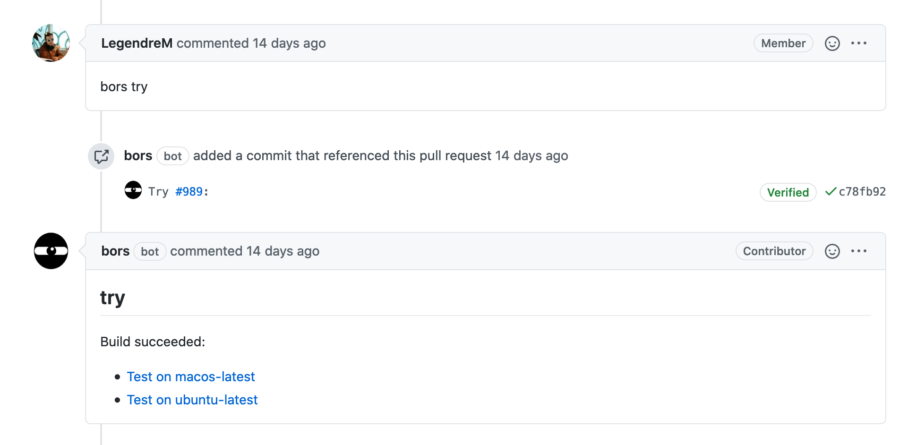
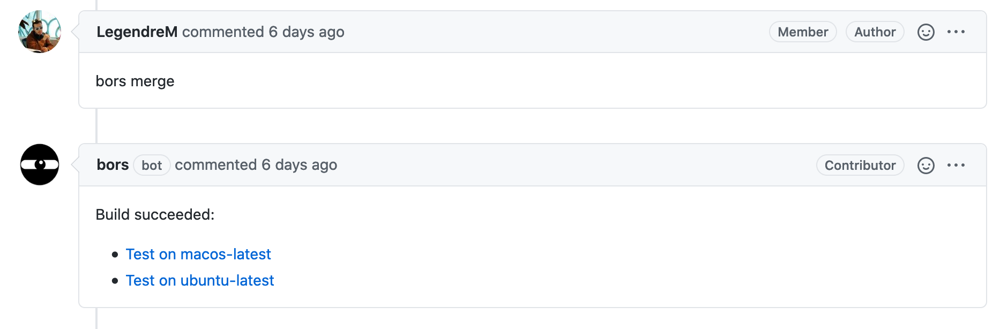

# Bors: our Merge Bot for PRs

[Bors](https://github.com/bors-ng/bors-ng) is a tool that helps us manage the merge of the PRs.

## Motivations

One of our requirements to merge a PR is the branch has to be up-to-date with the `master` branch.<br>
The only proper way to keep the Git history clear is to rebase the branch of the PR.

It became tedious to always ask the contributors to rebase their branch when their branch was not up-to-date with `master` because:
- It forces everyone to wait again before the merge
- It is not always easy to successfully apply a rebase without any issue

### But why rebasing?

The goal of a rebase is to move the commits (from the PR branch) right after the last commit on `master`.<br>
Therefore, rebasing keeps your Git history clear and consistent with the order in which you have merged your PRs.

But most of all rebasing is the only way to guarantee that the work that is going to be merged fits the current work in production. If the tests pass on an up-to-date branch, it ensures the tests will pass once merged into `master`, assuring your production branch will not break.

## How does Bors work?

Bors is a bot that automatically applies a rebase before passing the tests and merging.<br>
This allows us to _automatically maintain a repository of code that always passes all the tests__ (cf [this article](https://graydon2.dreamwidth.org/1597.html) by the creator of Bors)

### Usage

All the Bors commands have to be given through comments in the PR.

#### Simple Check

To check the PR passes all the tests when up-to-date with `master`, use:

```
bors try
```



**This command is only useful when the PR is not up-to-date with `master`**, but the reviewers want to be sure the changes do not break the current code in production.<br>
No merge is going to be done with this command.

#### Automatic Merge

To rebase and merge the PR, use:

```
bors merge
```



Bors is going to check the PR passes the tests when up-to-date with `master` and then merge the rebased work.

💡 Bors is also able to manage multiple merging PRs at the same time. Each PR is added to a queue and will be checked with the last version on `master`.

### More details

In fact, Bors does not concretely rebase the branch of the PR: it merges the commits of the PR into another branch that is already up-to-date with `master`:

- `trying` when doing a `bors try`
- `staging` when doing a `bors merge`

If the tests do not pass on one of these branches, Bors returns a failure and stops the merge of the PR (if doing a `bors merge`)

### Limitation

Bors cannot work when there are Git conflicts. Indeed, when Git conflicts with the `master` branch are present, Bors cannot take the decision about what the contributor wants to do.

In this situation, the contributor has to rebase the branch manually. Check out this [quick tutorial](https://gist.github.com/curquiza/5f7ce615f85331f083cd467fc4e19398) to successfully apply the rebase from a forked repository.
